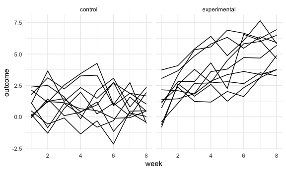
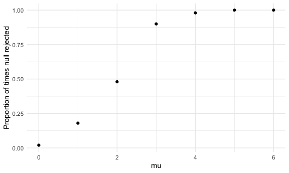
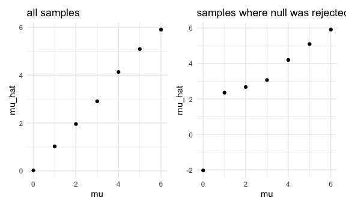

HW 5
================
Rachel Tao
11/10/20

## Problem 1

``` r
homicide_df <- read_csv("./homicide_data/homicide-data.csv") %>% 
  mutate(
    city_state = str_c(city, state, sep = "_"),
    resolved = case_when(
      disposition == "Closed without arrest" ~ "unsolved",
      disposition == "Open/No arrest" ~ "unsolved",
      disposition == "Closed by arrest" ~ "solved",
    )
  ) %>% 
  select(city_state, resolved) %>% 
  filter(city_state != "Tulsa_AL")
```

    ## Parsed with column specification:
    ## cols(
    ##   uid = col_character(),
    ##   reported_date = col_double(),
    ##   victim_last = col_character(),
    ##   victim_first = col_character(),
    ##   victim_race = col_character(),
    ##   victim_age = col_character(),
    ##   victim_sex = col_character(),
    ##   city = col_character(),
    ##   state = col_character(),
    ##   lat = col_double(),
    ##   lon = col_double(),
    ##   disposition = col_character()
    ## )

Let’s look at this a bit

``` r
aggregate_df =  
  homicide_df %>% 
  group_by(city_state) %>% 
  summarize(
    hom_total = n(),
    hom_unsolved = sum(resolved == "unsolved")
  )
```

    ## `summarise()` ungrouping output (override with `.groups` argument)

Can I do a prop test for a single city?

``` r
prop.test(
  aggregate_df %>% filter(city_state == "Baltimore_MD") %>% pull(hom_unsolved),
  aggregate_df %>% filter(city_state == "Baltimore_MD") %>% pull(hom_total)) %>% 
  broom::tidy()
```

    ## # A tibble: 1 x 8
    ##   estimate statistic  p.value parameter conf.low conf.high method    alternative
    ##      <dbl>     <dbl>    <dbl>     <int>    <dbl>     <dbl> <chr>     <chr>      
    ## 1    0.646      239. 6.46e-54         1    0.628     0.663 1-sample… two.sided

Try to iterate ……..

``` r
results_df <-   
  aggregate_df %>% 
  mutate(
    prop_tests = map2(.x = hom_unsolved, .y = hom_total, ~prop.test(x = .x, n = .y)),
    tidy_tests = map(.x = prop_tests, ~broom::tidy(.x))
  ) %>% 
  select(-prop_tests) %>% 
  unnest(tidy_tests) %>% 
  select(city_state, estimate, conf.low, conf.high)
```

``` r
results_df %>% 
  mutate(city_state = fct_reorder(city_state, estimate)) %>% 
  ggplot(aes(x = city_state, y = estimate)) +
  geom_point() +
  geom_errorbar(aes(ymin = conf.low, ymax = conf.high)) +
  theme(axis.text.x = element_text(angle = 90, vjust = 0.5, hjust = 1))
```


## Problem 2

import one dataset

``` r
data_1 = read_csv("./lda_data/con_01.csv")
```

tidy dataset

``` r
path_df = 
  tibble(
    path = list.files("lda_data")
  ) %>% 
  mutate(
    path = str_c("lda_data/", path),
    data = map(path, read_csv)) %>% 
  unnest(cols = data) %>% 
  separate(path, into = c("file", "arm", "ID"), sep = "_") %>% 
  select(-file) %>% 
  mutate(
    arm = str_replace(arm, "data/", ""),
    arm = if_else(arm == "exp", "experimental", "control"),
    ID = str_replace(ID, ".csv", ""),
    ID = as.numeric(ID)
  ) %>% 
  pivot_longer(
    cols = week_1:week_8,
    names_to = "week",
    names_prefix = "week_",
    values_to = "outcome"
  ) %>% 
  mutate(
    week = as.numeric(week))
```

spaghetti plot

``` r
spaghetti <- path_df %>% 
  ggplot(aes(x = week, y = outcome, group = ID)) + 
  geom_line() +
  facet_grid(. ~arm)

spaghetti
```



While the values of the outcome for the control group remained stable
over the 8 weeks of the experiment, the values of the outcome for the
experimental group increased for each subject.

## Problem 3

``` r
sim = function(mu, n = 30, sigma = 5) {
  
  sim_data = tibble(
    x = rnorm(mean = mu, n, sd = sigma)
  )
  
  sim_data %>% 
    t.test() %>% 
    broom::tidy() %>% 
    select(estimate, p.value) %>% 
    rename("mu_hat" = "estimate") %>% 
    mutate(rejected = if_else(p.value < 0.05, 1, 0))
  
}

sim_results =
  tibble(mu = c(0, 1, 2, 3, 4, 5, 6)) %>% 
  mutate(
    output_lists = map(.x = mu, ~rerun(50, sim(mu = .x))),
    estimate = map(output_lists, bind_rows)
    ) %>% 
  select(-output_lists)
```

calculate power:

``` r
prop_reject <- function(df){
  rejected  = (data = df) %>% pull(3) %>% sum()
  
  total = (data = df) %>% nrow()
  
  power = rejected/total
  
  power
}

power = tibble(
  mu = c(0, 1, 2, 3, 4, 5, 6),
  power = map(sim_results$estimate, prop_reject)
) %>% 
  unnest(cols = power) %>% 
  ggplot(aes(x = mu, y = power)) +
  geom_point() +
  labs(x = "mu",
       y = "Proportion of times null rejected")


power
```



find average estimate of mu\_hat for each dataset:

``` r
average <- function(df){
  data = df %>% pull(1) %>% mean()
}

mu_hat = tibble(
  mu = c(0, 1, 2, 3, 4, 5, 6),
  mu_hat = map(sim_results$estimate, average)
) %>% 
  unnest(cols = mu_hat) %>% 
  ggplot(aes(x = mu, y = mu_hat)) +
  geom_point() +
  ggtitle("all samples")
```

find average estimate of mu\_hat including only samples where the null
was rejected

``` r
mu_0 = sim_results$estimate[[1]] %>% filter(rejected == 1) %>% average()
mu_1 = sim_results$estimate[[2]] %>% filter(rejected == 1) %>% average()
mu_2 = sim_results$estimate[[3]] %>% filter(rejected == 1) %>% average()
mu_3 = sim_results$estimate[[4]] %>% filter(rejected == 1) %>% average()
mu_4 = sim_results$estimate[[5]] %>% filter(rejected == 1) %>% average()
mu_5 = sim_results$estimate[[6]] %>% filter(rejected == 1) %>% average()
mu_6 = sim_results$estimate[[7]] %>% filter(rejected == 1) %>% average()

rejected =
  tibble(mu = c(0, 1, 2, 3, 4, 5, 6),
         mu_hat = c(mu_0, mu_1, mu_2, mu_3, mu_4, mu_5, mu_6)) %>% 
  ggplot(aes(x = mu, y = mu_hat)) +
  geom_point() +
  ggtitle("samples where null was rejected")

mu_hat + rejected
```



For higher values of mu, the average estimated sample mean among samples
where the null was rejected is very similar to to the average estimated
sample mean among all samples, but this is less true at mu = 0 and mu =
1 . This is because there are fewer samples where the null rejected at
low values of mu, since our null hypothesis was mu = 0. Therefore, at
lower values of mu, there is more noise among samples where the null was
rejected, leading to unstable estimates of of mu\_hat. However, at
higher values of mu, the null was rejected for most of the samples, so
mu\_hat could be estimated using a more of the samples, leading to more
stable estimates of mu\_hat, the further away mu was from zero.
